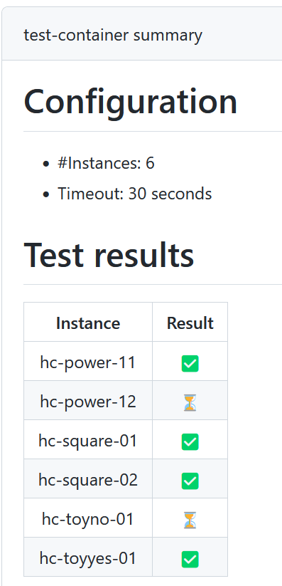

# README: Submission


## ToDo before Submission

  1. Develop your solver
     - (Check) your solver can accept [the input file format](https://core-challenge.github.io/2023/format/)?
     - (Check) your solver can print [the output format](https://core-challenge.github.io/2023/format/) to standard out?
  2. Clone this repository [2023solver-submission](https://github.com/core-challenge/2023solver-submission) and edit it as your private repository. This repository contains a GitHub Actions and checks your files are fine or not everytime you push. 
  3. Create a solver executable on ubuntu 20.04 as a Dockerfile (see below and [sample file](/container/Dockerfile)).
  4. Write your solver description as [main.tex](/description/main.tex). 
  5. The final state of your Github private repository is:
     - `container/Dockerfile` is edited and `[container/]$ docker build -f Dockerfile -t solver-name .` will build your solver docker image.
     - Using your docker image, `docker run --rm -t -v /ABSOLUTEPATH/2023solver-submission/container/test-instances:/test solver-name /test/hc-toyyes-01.col /test/hc-toyyes-01_01.dat` will print a result.
       - Note: ABSOLUTEPATH must be the absolute path where the cloned repository downloaded.
     - `description/main.tex` can be compiled using `latexmk` (You can check the compiled PDF via the `Description` in the `Artifacts` as shown below).

       
  6. Everytime you push, [GitHub Actions](https://github.com/core-challenge/2023solver-submission/actions) tell you whether your files are fine or not as shown below. Please make the status all green before your submission (it is okay when some instances cannot be solved due to timeout). You can get the logs for all the instances via the `results` in the `Artifact`.
  

## How to write your Dockerfile

### For Docker experts

- The only requirement is to describe your solver command as [ENTRYPOINT](https://docs.docker.com/engine/reference/builder/#entrypoint) which accepts 2 arguments `*.col` and `*.dat` when we execute it. Please use `ubuntu:20.04`.
- [Sample file](/container/Dockerfile) is one satisfying this requirement.

### For others

- You can find the official reference of Dockerfile [here](https://docs.docker.com/engine/reference/builder/). 
- What you need to do is 
  - (local machine) prepare your solver and put all necessary files into YOUR-SOLVER-MATERIAL-DIR (any name you want).
  - (local machine) copy YOUR-SOLVER-MATERIAL-DIR into the `container` directory of your private repository.
  - (local machine) edit the Dockerfile below so that your solver can run.
  - Please use `ubuntu:20.04`.
- Or, if you can put all files into a PUBLIC repository, just clone it and compile it in Dockerfile. You do not need to copy local files. 


``` bash
FROM ubuntu:20.04

#------------------------------------------------
# (1) install fundamental commands
#------------------------------------------------
RUN \
    apt update && \
    apt -y upgrade && \
    apt install -y curl git man unzip sudo # if you need any

#   Hint: you may want to additionally install the followings. 
# 
#   apt install -y build-essential
#   apt install -y software-properties-common

#------------------------------------------------
# (2) install your solver
#------------------------------------------------
COPY YOUR-SOLVER-MATERIAL-DIR /solver-dir
WORKDIR /solver-dir

## .. write your solver install commands ..

# or if you can put all files into a PUBLIC repository
# just clone it and compile it
#
# git clone your-solver-repository
# ... write your solver install commands ...

#------------------------------------------------
# (3) write your solver execution command as ENTRYPOINT
# this command should accept 2 arguments *.col and *.dat
#------------------------------------------------

ENTRYPOINT ["/solver-dir/solver-executable", "OPTION"]
```

### Example

- See [Dockerfile](/container/Dockerfile) of this repository which launches [an example solver](https://github.com/core-challenge/util-example-solver). 
- Since this solver is available in a public repository, we do not need a copy of local files (just cloning it). 
- And, since this solver runs on JVM, we do not need to compile it in Docker file. 


## Check List before Submission

- [ ] your solver can accept [the input file format](https://core-challenge.github.io/2023/format/)?
- [ ] your solver can print [the output format](https://core-challenge.github.io/2023/format/) to standard out?
- [ ] In your container `[at container/]$ docker build -f Dockerfile -t solver-name .` will build your solver docker image?
- [ ] Using your docker image, `docker run --rm -t -v /ABSOLUTEPATH/2023solver-submission/container/test-instances:/test solver2 /test/hc-toyyes-01.col /test/hc-toyyes-01_01.dat` will print appropriate results?
- [ ] Does "Github action" status of your private repository only include green (:white_check_mark:) or timeout (:hourglass_flowing_sand:)?

## Launching Options

- We execute your solver only with two input files by default (i.e., `your-solver input.col input.dat`).
- If there are additional options besides the two input files, such as specifying memory size or switching shortest/extent/longest solvers, please describe them in the [launchingOptions.csv](/container/launchOptions.csv) file.
  - Please describe the two input files as `COLFILE` and `DATFILE` and the Maximum memory (we expect around 54GB out of 64GB) as `MAX_MEMORY_SIZE` in GB (54 in case of 54GB).
  - Note that such additional options must not be included in the `ENTRYPOINT` instruction in the `Dockerfile`.
- An example is as follows. The 1st column is reserved.

```
shortest,--shortest,COLFILE,DATFILE
existent,--existent,--momory-size=MAX_MEMORY_SIZE,COLFILE,DATFILE
longest,--longest,COLFILE,DATFILE
```


### Multiple Solvers for One Metric

If you have multiple solvers for one metric please add indices to the 1st column.

```
shortest1,--shortest,specific_option1,COLFILE,DATFILE
shortest2,--shortest,specific_option2,COLFILE,DATFILE
```

### If your solver is a single-engine solver

We are encouraging participants to develop single-engine solvers 
(not using "parallel portfolios" and "sequential portfolios").
If your solver is a single-engine solver, 
please add a comment following `#` to the CSV file.

```
# shortest1 is a single-engine solver. 
shortest1,--shortest,specific_option1,COLFILE,DATFILE
shortest2,--shortest,specific_option2,COLFILE,DATFILE
```


## ToDo at the Submission

  1. please fill in and send your information through [this Google form](https://forms.gle/CGYfrksJASwGUpWYA).
  2. submit your private Github repository by adding `TakehideSoh` and `tom-tan` as members.
